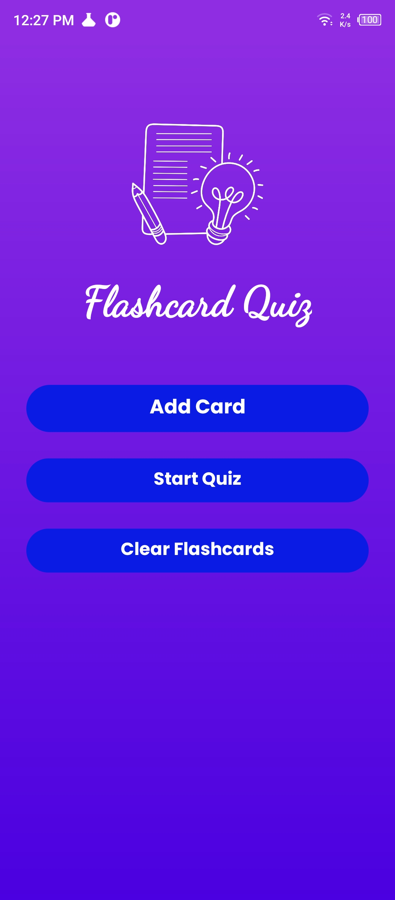

# 🧠 Flashcard Quiz App – Learn Smarter, Remember Better

A fun and lightweight flashcard quiz app designed to help you learn, revise, and test your knowledge with ease.

---

📱 Features

✅ Create, edit, and delete flashcards with questions and answers

🎮 Take interactive quizzes with your flashcards

🔄 Randomized questions each time you quiz

📊 Save and view your previous quiz scores

🧼 Clean and simple user interface for smooth experience

💾 Local data storage using SharedPreferences

---

📸 Screenshots

  
  
  
  
  

---

🧰 Tech Stack

Language: Java

Storage: SharedPreferences

UI: Android XML + Material Design

Architecture: Simple MVC (Model-View-Controller) pattern

---

🛠️ Contribution

This project is currently closed source. Contributions, forks, or reuse of any part of the code are not permitted without prior written permission.

---

🔒 License

© 2025 Ramzy Ahmed. All rights reserved.

This project is protected by copyright law.

Any unauthorized use, reproduction, modification, or distribution of the code or any part of this project is strictly prohibited without the explicit written permission of the author.

---

## 🙌 Author

Developed with passion by **Ramzy Ahmed**  
Feel free to connect on [LinkedIn](https://www.linkedin.com/in/ramzy-ahmed)
